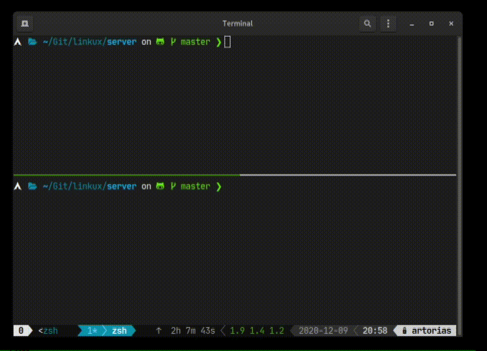

# Linkux Server

Linuks server is the process in charge of retrieving the GPU status data and server it through an API Rest server.



## Installation

Compile with Rust:

```bash
cargo build
```

## Usage

Execute the compiled binary or by using cargo:

```bash
cargo run
```

Using the `--help` flag you can see the available flags for the application


## Contributing

Pull requests are welcome. For major changes, please open an issue first to discuss what you would like to change.